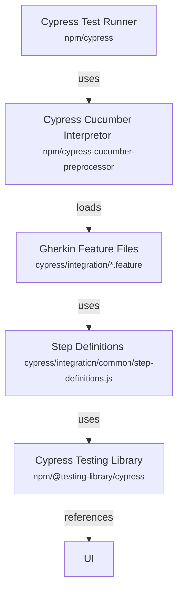

# Organogram  

---

## What is this?

This repo is aimed at front-end developers to use as a reference for how to set up and build a project with ATDD, simple build pipelines, code quality metrics, etc. The current Solid.js implementation is just an incidental detail (I wanted to poke around with it anyway). The core idea is that the underlying UI should be replaceable without changing a single test.

### Testing Structure

#### Acceptance Tests

---

## Getting Started

1. Copy the `.env.example` file
2. Rename the copied file to `.env`
3. Update the variables as necessary
4. Run: `npm install`

---

## Usage

### `npm dev`

Runs the app in the development mode, and also runs the e2e tests in watch mode.
Open [http://localhost:3000](http://localhost:3000) to view it in the browser.

The page will reload if you make edits.

### `npm start`

Runs the app in the development mode. 
Open [http://localhost:3000](http://localhost:3000) to view it in the browser.

### `npm run test:e2e`

Opens the Cypress launchpad for testing

### `npm run test:e2e:headless`

Runs the Cypress e2e tests in headless mode

### `npm run test:e2e:headless:watch`

Runs the Cypress e2e tests in headless mode while watching for file changes

### `npm run build`

Builds the app for production to the `dist` folder. 
It correctly bundles Solid in production mode and optimizes the build for the best performance.

The build is minified and the filenames include the hashes. 
Your app is ready to be deployed!

## Deployment

This repo is currently set up to use GitHub Pages for simple hosting (see: `.github/workflows/main.yml`)
